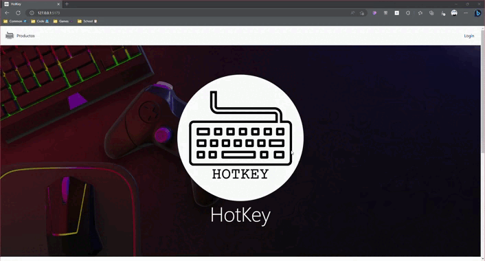

# MichiStore 🐈


HotKey, la tienda por excelencia para comprar tus teclados y switches para teclados ✨

Esta aplicacion fue creada con Mongo, Express, React y NodeJS

### Preview de la pagina ✨



## ¿Como empezamos?

Empecemos haciendo lo necesario para correr el proyecto 😁

```bash
git clone https://github.com/EzzCream/HotKey.git
cd Backend
npm i - Para instalar los nodemodules
npm run dev - Para correr la app
cd Frontend
npm i - Para instalar los nodemodules
npm run dev - Para correr la app
```

## Variables de entorno

El proyecto hace uso de Firebase-Firestore por lo que hay elementos que se tienen que proteger... Por esta razon este proyecto tiene variables de entorno. Puedes ver un ejemplo en el .env.ejemplo de las variables necesarias

## Componentes creados

-   NavBar
    -   Es la barra de navegacion, esta se encarga de facilitarnos el movimiento por la pagina
-   Item, Item List y Item List Container
    -   Item: Aqui es lo que nos porporciona la informacion general de lo que es item
    -   Itemlist: Esta es la parte que se encarga de decir cuales items se van a mostrar
    -   ItemListCotainer: Es el contenedor que va a guardar los item listados
-   ItemCount
    -   El cotador donde puedes agregar tus productos
-   ItemDetal y ItemDetailContainer
    -   Se muestra el detalle del item que sea deseado
    -   Y el contenedor es donde se almacena la informacion de item con el contador para que se agregue algun producto
-   CartWidget
    -   El icono del
-   Loading
    -   Componente dedicado para mostrar el loading
-   Inicio
    -   Muestra el inicio de la pagina
-   Cart y CartDetail
    -   Cart: La informacion que se muestra en el carrito
    -   CartDetail: Muestra el detalle de los productos que se agregaron al carrito
-   Finalizar y Orden
    -   Finalizar: Se muestra al finalizar la compra, se encuentra un formulario, en el cual tienes que poner los datos de envio y un resumen de la compra
    -   Orden: Muestra el id de orden y un link para regresar a ver los productos
